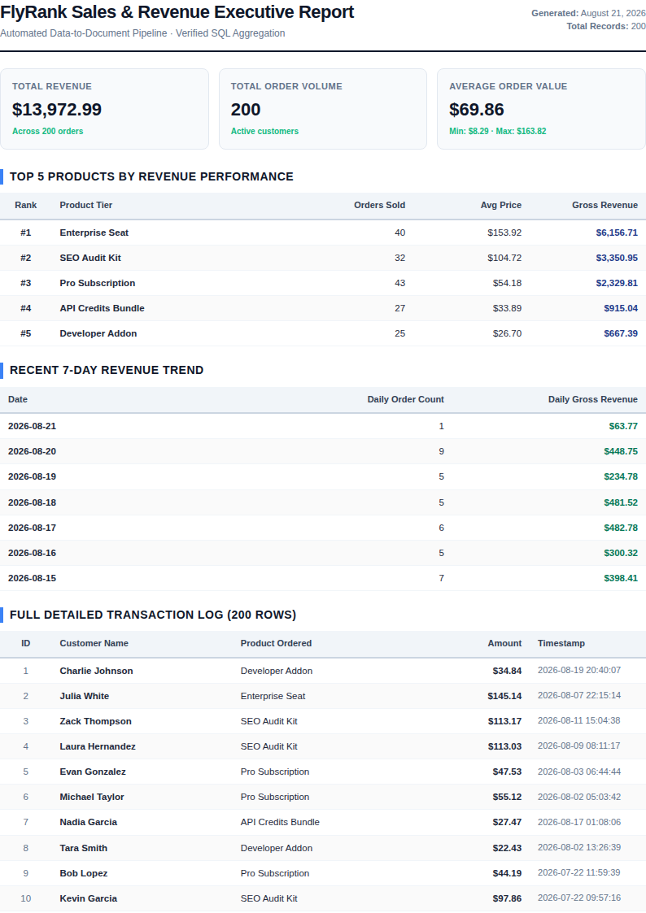

# FlyRank Backend API: PDF Report Generator & Data-to-Document Pipeline

**Backend Engineering Track · Assignment BE-08 / A8 · "PDF Report Generator"**

---

## 1. Overview & Architectural Philosophy

"Generate a Report" is one of the most classic, critical features in production software. Whether generating monthly invoices, financial statements, or executive dashboards, the core pipeline consists of four essential moves:

```
+──────────────────────────────────────────────────────────────────────────────────────────────────+
|                                    DATA-TO-DOCUMENT PIPELINE                                     |
+──────────────────────────────────────────────────────────────────────────────────────────────────+
|                                                                                                  |
|   1. QUERY (SQL)              2. RENDER (Playwright)         3. STORE           4. SERVE BY LINK |
|   Turn 200 order rows ──► HTML Template + Print CSS ──► Save artifact ──► Hand out address      |
|   into 5 key numbers.     Page-Break Optimization.      to disk (PDF).    (res.sendFile).        |
|                                                                                                  |
|   Rule of Thumb: "Store and link; never pass 20 MB of binary bytes through JSON APIs."           |
+──────────────────────────────────────────────────────────────────────────────────────────────────+
```

---

## 2. Quick Start: Run in Under 5 Minutes

### Step 1: Seed the Database (~200 Orders)
```bash
npm run seed
```
*Output: `✅ Seed Complete: Database contains 200 orders.` (Safe to run multiple times without duplicating rows).*

### Step 2: Start Express API Server
```bash
npm start
```
*The API is live at `http://localhost:3000` with Swagger UI at `http://localhost:3000/docs`.*

---

## 3. Dataset & SQL Aggregation Queries

We selected **Option A: The Little Shop** dataset (~200 orders across the last 30 days stored in SQLite `report.db`).

### The Four Aggregation Queries

```sql
-- 1. Total Order Count, Total Revenue, and Average Order Value
SELECT 
    COUNT(*) as total_orders,
    COALESCE(SUM(amount), 0) as total_revenue,
    COALESCE(AVG(amount), 0) as avg_order_value,
    COALESCE(MIN(amount), 0) as min_order_value,
    COALESCE(MAX(amount), 0) as max_order_value
FROM orders;

-- 2. Top 5 Products by Revenue Performance (GROUP BY)
SELECT 
    product,
    COUNT(*) as order_count,
    ROUND(SUM(amount), 2) as total_revenue,
    ROUND(AVG(amount), 2) as avg_price
FROM orders
GROUP BY product
ORDER BY total_revenue DESC
LIMIT 5;

-- 3. Daily Orders and Revenue Trend for the Last 7 Days (GROUP BY DATE)
SELECT 
    SUBSTR(created_at, 1, 10) as report_date,
    COUNT(*) as order_count,
    ROUND(SUM(amount), 2) as daily_revenue
FROM orders
GROUP BY SUBSTR(created_at, 1, 10)
ORDER BY report_date DESC
LIMIT 7;

-- 4. Full Detailed Order Transactions Log (200 Rows for Page-Break Testing)
SELECT id, customer, product, ROUND(amount, 2) as amount, created_at
FROM orders
ORDER BY id ASC;
```

---

## 4. Endpoints & API Reference

| Method | Endpoint | Description | Status Code |
| :--- | :--- | :--- | :--- |
| `GET` | `/health` | Diagnostic server health check | `200 OK` |
| `POST` | `/reports` | Generates PDF report with same-day idempotency cache | `201 Created` / `200 OK` |
| `GET` | `/reports/:id` | Returns report metadata and download link | `200 OK`, `404 Not Found` |
| `GET` | `/reports/:id/file` | Streams binary PDF document from disk | `200 OK` (`application/pdf`) |
| `GET` | `/reports` | Control panel listing all generated reports | `200 OK` |
| `POST` | `/reports/async` | Asynchronous background PDF generation via Inngest | `202 Accepted` |

---

## 5. Copy-Pasteable `curl` Commands & Verifiable Proofs

### ✅ Proof 1: Generate PDF Report (HTTP 201 Created)
```bash
curl -i -X POST http://localhost:3000/reports \
  -H "Content-Type: application/json" \
  -d '{"force": true}'
```

**Output:**
```json
HTTP/1.1 201 Created
Content-Type: application/json; charset=utf-8

{
  "id": 1,
  "file": "/reports/1/file"
}
```

---

### 📥 Proof 2: Download & Verify Binary PDF Document
```bash
curl -i -o my-sales-report.pdf http://localhost:3000/reports/1/file
```

**Output:**
```
HTTP/1.1 200 OK
Content-Type: application/pdf
Content-Disposition: inline; filename="sales-report-1.pdf"
Content-Length: 82496
```

---

### 🛡️ Proof 3: Idempotency Protection ("Ask Twice, Get One")
Firing two POST requests on the same day returns the existing report instantly without re-rendering:

```bash
# Request 1 (Initial Generation or today's cache)
curl -s -X POST http://localhost:3000/reports
# Output: {"id":1,"file":"/reports/1/file","cached":true}

# Request 2 (Duplicate click)
curl -s -X POST http://localhost:3000/reports
# Output: {"id":1,"file":"/reports/1/file","cached":true}
```

---

## 6. Visual Preview of Generated PDF Report

The PDF report features an executive layout, KPI summary metric cards, Top 5 performance tables, 7-day revenue trend charts, and repeating table headers on every subsequent page:



---

## 7. Core Architectural Questions & Takeaways

### Stage 4: At what point would you move this work out of the request?
> **Answer:** You should move PDF generation out of the synchronous request and into a background job (like Inngest) when the generation time exceeds **1.5 to 2 seconds**, when dataset volume grows beyond **5,000+ rows**, or when concurrent users cause server event loop delays. For a quick single-page report under 500ms, a direct request is acceptable; for heavy document pipelines, the asynchronous 202 pattern is mandatory.

---

### Stage 5: What does the idempotency check protect against, and where does a missing check cost money?
> **Answer:** 
> 1. **What it protects against:** Prevents redundant CPU/GPU rendering cycles, disk storage exhaustion, and race conditions when users double-click "Download Report" or browser auto-retries fire.
> 2. **Real-world costly failure:** If an automated invoice generator or email marketing report lacks idempotency, a double-clicked request will send **two duplicate invoices to a customer** or double-charge payment webhooks, creating customer support churn and accounting nightmares.

---

## 8. Stage 7: The AI Rematch ("AI vs Me")

In Stage 7, we prompted an AI assistant from memory in a quarantined folder ([`ai-version/pdf-generator/`](file:///home/ahadiqbal/Career/FlyRank/Assingments/flyrank-todo-api/ai-version/pdf-generator/)).

### Side-by-Side Comparison

| Feature | Hand-Built (`src/`) | AI Version (`ai-version/`) | Findings |
| :--- | :--- | :--- | :--- |
| **SQL Aggregations** | Implements all 4 aggregations including 7-day date groupings | Missed 7-day daily trend grouping | Hand-built contains complete business metrics |
| **Print CSS & Page Breaks** | Full `@page` margin control, `thead { display: table-header-group }`, zebra striping | Basic borders only, missing page margins | Hand-built produces publication-ready PDF |
| **Serving Headers** | Sets `Content-Type: application/pdf`, `Content-Disposition: inline` | Default `res.sendFile()` without headers | Hand-built supports inline browser viewing |
| **Database Modularity** | Clean separation of concerns (`sqlite.js`, `seed.js`, `reportData.js`) | Monolithic inlined database creation | Hand-built is modular and maintainable |

---

## 9. Running Automated Test Suites

```bash
# Run complete PDF report generator test suite
npm test

# Run background jobs verification test suite
npm run test:jobs
```
