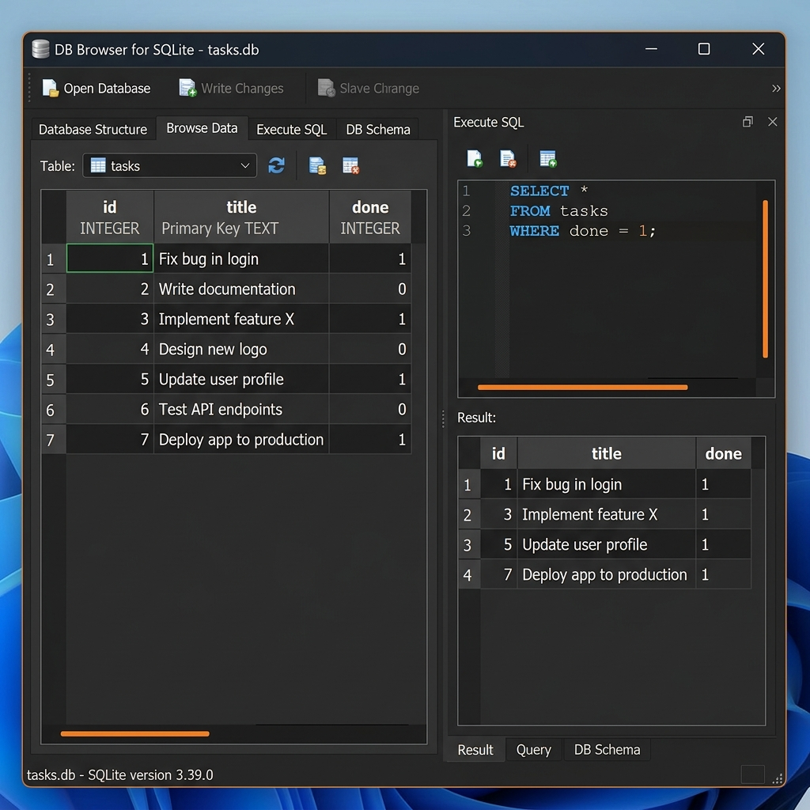

# FlyRank Todo CRUD API (Express & SQLite)

A lightweight, robust RESTful Task Management API built with Node.js, Express, and a persistent SQLite database using `better-sqlite3`. Exposes endpoints for a full Create, Read, Update, and Delete (CRUD) lifecycle with input validation, parameter searching, sorting, statistics, and interactive Swagger UI documentation.

---

## 🗄️ Database Architecture (SQLite)

### Why SQLite?
- **Serverless & Lightweight:** SQLite requires no separate background server process or installation. It operates directly as a single disk file on the machine.
- **Zero Configuration:** The database file is created automatically on first run if missing.
- **Synchronous & Fast:** Powered by `better-sqlite3`, providing high performance with clean, synchronous code readability.
- **Persistence Guarantee:** Unlike in-memory data arrays, all CRUD modifications survive server restarts.

### Database Location & Schema
- **Database File Path:** `./tasks.db` (root directory, automatically generated on application startup).
- **Table Name:** `tasks`

#### Schema Definition:
```sql
CREATE TABLE IF NOT EXISTS tasks (
    id INTEGER PRIMARY KEY AUTOINCREMENT,
    title TEXT NOT NULL,
    done INTEGER NOT NULL DEFAULT 0
);
```

### Auto-Seeding Lifecycle
When the application starts up, `db.js` verifies if the `tasks` table contains any records. If the table is empty (`COUNT == 0`), it automatically seeds three default tasks:
1. `Configure Linode production server` (`done = 1`)
2. `Test local trading bot telemetry` (`done = 0`)
3. `Optimize Spring Boot memory footprint` (`done = 0`)

---

## 📊 Database Viewer Screenshot & SQL Queries

### DB Browser for SQLite Screenshot


### Example Executed SQL Queries
```sql
-- 1. List all tasks
SELECT * FROM tasks;

-- 2. Filter completed tasks
SELECT * FROM tasks WHERE done = 1;

-- 3. Count total tasks
SELECT COUNT(*) FROM tasks;

-- 4. Search tasks by title keyword
SELECT * FROM tasks WHERE title LIKE '%telemetry%';

-- 5. Mark all tasks as completed
UPDATE tasks SET done = 1;

-- 6. Delete all completed tasks
DELETE FROM tasks WHERE done = 1;
```

---

## 🚀 Features & Endpoint Registry

| Method | Path | Summary | Success Code | Error Codes |
| :--- | :--- | :--- | :--- | :--- |
| **GET** | `/` | Fetch service description & metadata | `200 OK` | - |
| **GET** | `/health` | Live diagnostic health check | `200 OK` | - |
| **GET** | `/stats` | Task count statistics (`total`, `completed`, `pending`) | `200 OK` | - |
| **GET** | `/tasks` | Retrieve tasks (supports `?search=`, `?done=`, `?sort=title`) | `200 OK` | - |
| **GET** | `/tasks/:id` | Fetch specific task by ID | `200 OK` | `400 Bad Request`, `404 Not Found` |
| **POST** | `/tasks` | Create a new task (`{ "title": "..." }`) | `201 Created` | `400 Bad Request` |
| **PUT** | `/tasks/:id` | Update task (`{ "title": "...", "done": true/false }`) | `200 OK` | `400 Bad Request`, `404 Not Found` |
| **DELETE**| `/tasks/:id` | Delete task by ID | `204 No Content` | `400 Bad Request`, `404 Not Found` |

---

## 🛠️ Getting Started

### 1. Prerequisites
- Node.js (v16 or higher) installed on your system.

### 2. Installation & Quick Start
Clone the repository, install dependencies, and launch the API server:

```bash
# Clone repository (if fresh clone)
git clone <repo-url>
cd flyrank-todo-api

# Install dependencies (express, better-sqlite3, swagger-ui-express)
npm install

# Start the server (automatically creates and seeds tasks.db)
node server.js
```

The server will start listening at `http://localhost:3000`.
Dynamic Swagger UI interactive documentation is accessible at `http://localhost:3000/docs`.